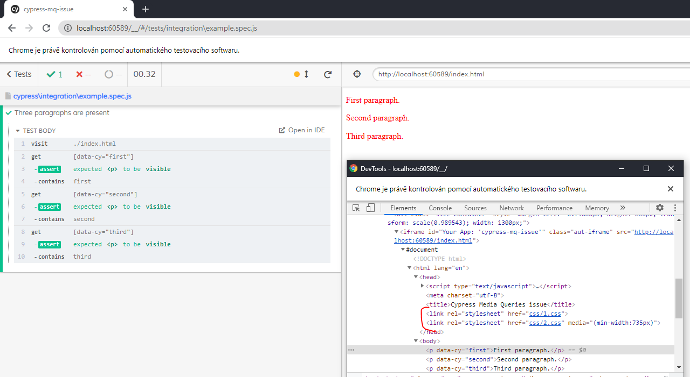
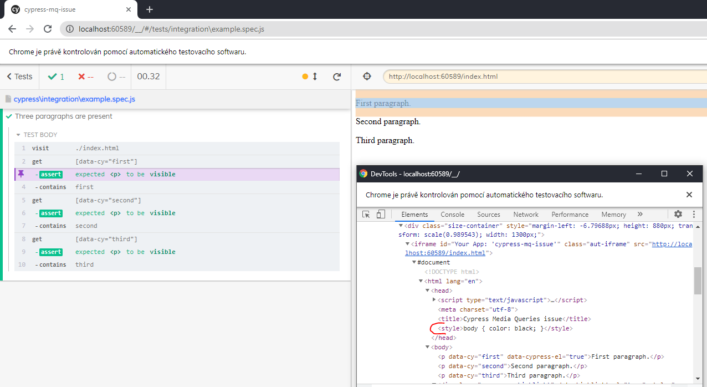

# Cypress media queries issue MWE

This is a minimal working example to simulate Cypress problem
with CSS links containing `media` attribute.

## Installation
```
npm i
```

## Run
```
npm run cypress:open
```

## Issue description
The example page links two CSS files. One with and one without `media` attribute:
```
<link rel="stylesheet" href="css/1.css">
<link rel="stylesheet" href="css/2.css" media="(min-width:735px)">
```

When the test is run via `cypress open` command (with GUI), during
the test itself everything seems to be OK. All links are included.



But if you then go back to the certain step, the link with the
`media` attribute is ignored/missing. The styles are probably taken from
the DOM snapshot, which was created in a wrong way.



Tested with Cypress v7.0.0 and viewport 1300 x 880.